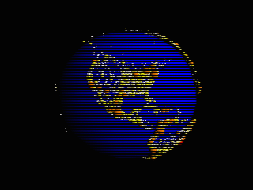

# Population of World Cities

Map of the world in which cities having populations of 10,000 or more (according to the (outdated) [World Cities Database](https://www.maxmind.com/en/free-world-cities-database) are rendered as spheres. The volume of the spheres is proportional to the population.
